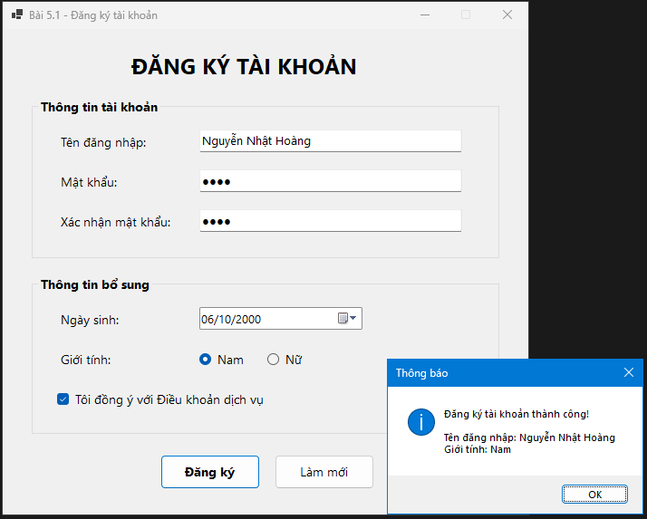
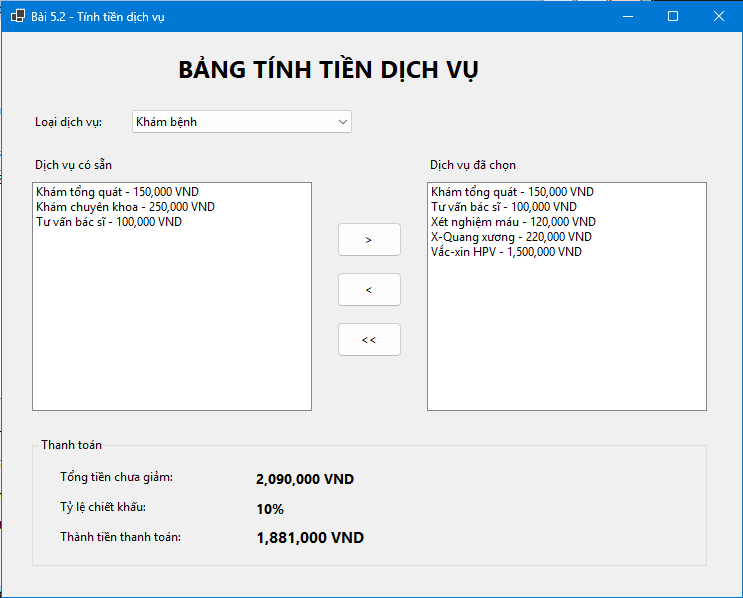
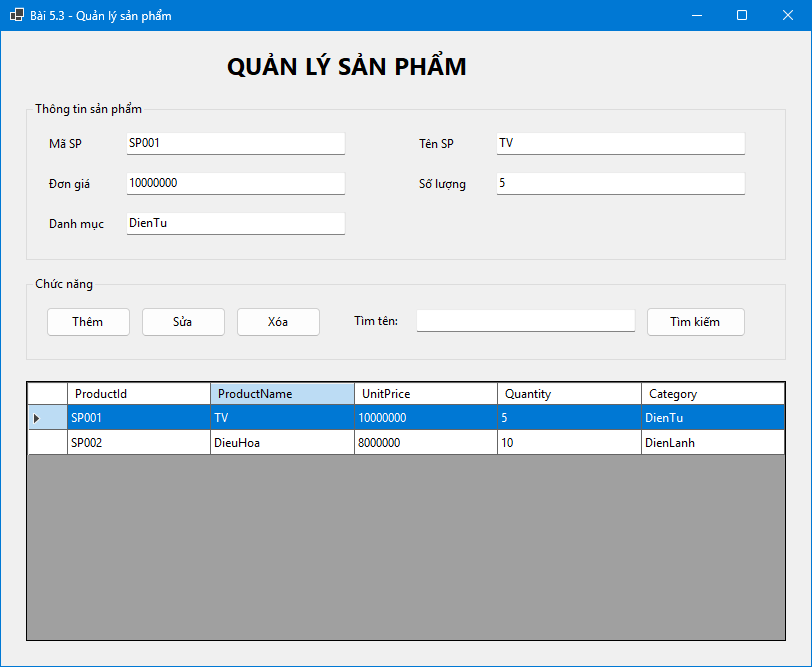
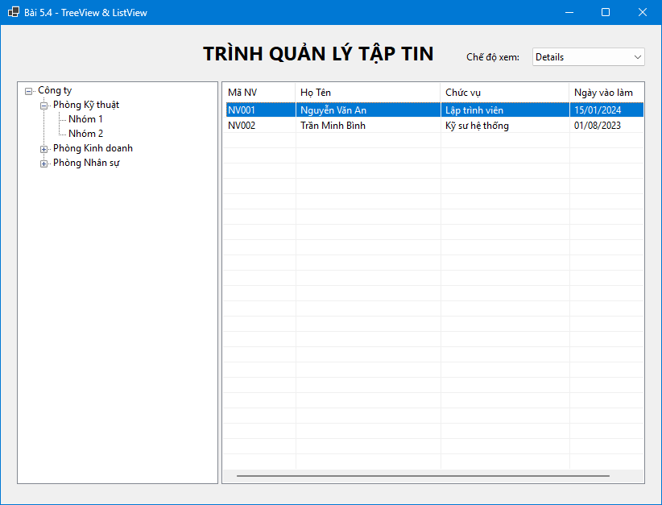

# BÀI THỰC HÀNH 5 - WINDOWS FORMS

## Bài 5.1 - Form đăng ký tài khoản và bắt lỗi giao diện

---

## Bài 5.2 - Bảng tính tiền dịch vụ và chiết khấu đơn hàng

---

## Bài 5.3 - Quản lý danh sách sản phẩm trong bộ nhớ

---

## Bài 5.4 - Trình quản lý tập tin dạng TreeView và ListView

