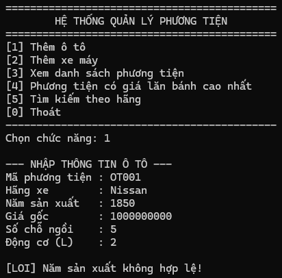
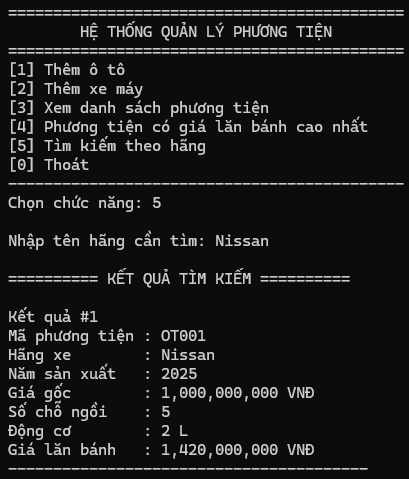
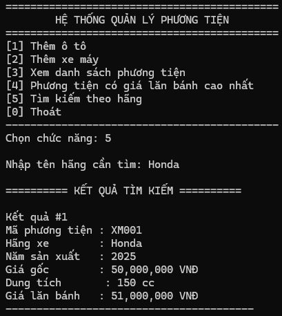
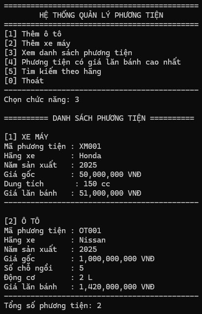
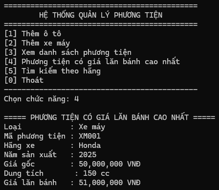

# BÀI 2 - LẬP TRÌNH HƯỚNG ĐỐI TƯỢNG (OOP)

## Hệ thống Quản lý Phương tiện Giao thông

Chương trình xây dựng hệ thống quản lý phương tiện giao thông gồm Ô tô và Xe máy.

### Các chức năng chính

- Thêm Ô tô.
- Thêm Xe máy.
- Kiểm tra dữ liệu đầu vào.
- Hiển thị danh sách phương tiện.
- Tính giá lăn bánh cho từng loại phương tiện.
- Tìm phương tiện có giá lăn bánh cao nhất.
- Tìm kiếm phương tiện theo tên hãng.

---

## KẾT QUẢ KIỂM THỬ

### TC01 - Kiểm tra Validation năm sản xuất

Nhập Ô tô có năm sản xuất `1850`.

Do năm sản xuất nhỏ hơn `1900`, chương trình phát hiện dữ liệu không hợp lệ và không thêm phương tiện vào danh sách.

---

### TC02 - Kiểm tra tính giá lăn bánh Ô tô

Thông tin Ô tô sử dụng để kiểm thử:

- Mã phương tiện: `OT001`
- Hãng xe: `Nissan`
- Năm sản xuất: `2025`
- Giá gốc: `1,000,000,000 VND`
- Số chỗ ngồi: `5`
- Động cơ: `2 L`

Vì Ô tô có số chỗ ngồi nhỏ hơn hoặc bằng 9 nên:

`Giá lăn bánh = Giá gốc + 12% Giá gốc + 30% Giá gốc`

Kết quả:

`1,000,000,000 + 120,000,000 + 300,000,000 = 1,420,000,000 VND`

---

### TC03 - Kiểm tra tính giá lăn bánh Xe máy

Thông tin Xe máy sử dụng để kiểm thử:

- Mã phương tiện: `XM001`
- Hãng xe: `Honda`
- Năm sản xuất: `2025`
- Giá gốc: `50,000,000 VND`
- Dung tích xy lanh: `150 cc`

Vì dung tích xy lanh nhỏ hơn `175 cc` nên:

`Giá lăn bánh = Giá gốc + 2% Giá gốc`

Kết quả:

`50,000,000 + 1,000,000 = 51,000,000 VND`

---

### TC04 - Kiểm tra đa hình với danh sách phương tiện

Thêm một đối tượng `OTo` và một đối tượng `XeMay` vào danh sách `List<PhuongTien>`.

Khi hiển thị danh sách, chương trình gọi phương thức tương ứng với từng loại đối tượng và tính đúng giá lăn bánh:

- Xe máy Honda: `51,000,000 VND`
- Ô tô Nissan: `1,420,000,000 VND`

Điều này thể hiện tính đa hình khi các đối tượng lớp con được quản lý thông qua lớp cha `PhuongTien`.

---

### TC05 - Tìm phương tiện có giá lăn bánh cao nhất

Chương trình sử dụng chức năng tìm phương tiện có giá lăn bánh cao nhất trong danh sách.

Danh sách gồm:

- Ô tô Nissan: `1,420,000,000 VND`
- Xe máy Honda: `51,000,000 VND`

Kết quả cần trả về Ô tô Nissan có mã `OT001` với giá lăn bánh:

`1,420,000,000 VND`

---

## SOURCE CODE

Code bài được lưu trong thư mục:

`Code/HeThongQuanLyPTGT`

File Solution:

`Code/HeThongQuanLyPTGT.slnx`