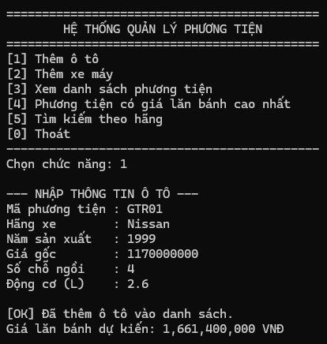
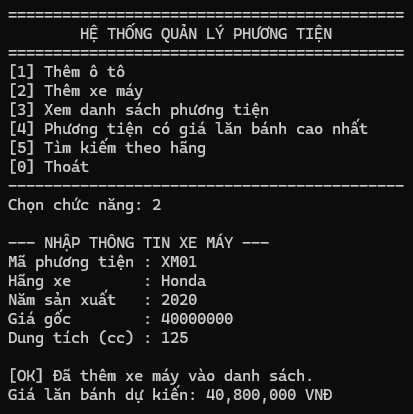
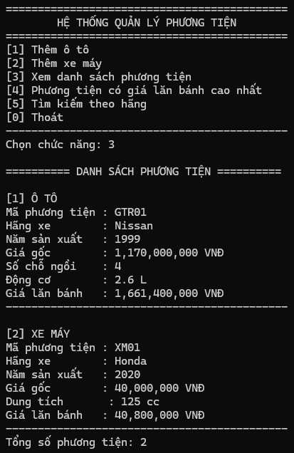
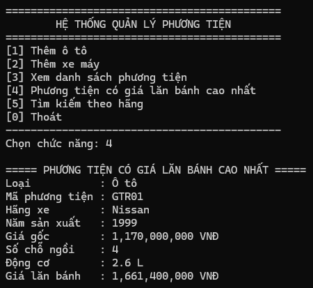
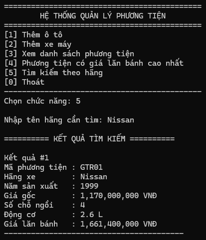
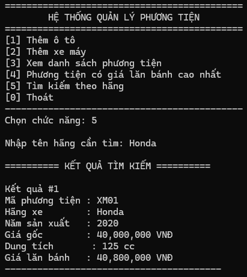

# BÀI 2 - LẬP TRÌNH HƯỚNG ĐỐI TƯỢNG (OOP)

## Hệ thống Quản lý Phương tiện Giao thông

Chương trình quản lý phương tiện giao thông gồm Ô tô và Xe máy.

### Các chức năng chính

- Thêm Ô tô.
- Thêm Xe máy.
- Hiển thị danh sách phương tiện.
- Tính giá lăn bánh cho từng phương tiện.
- Tìm phương tiện có giá lăn bánh cao nhất.
- Tìm kiếm phương tiện theo tên hãng.

---

## KẾT QUẢ CHẠY CHƯƠNG TRÌNH

### TC01 - Thêm Ô tô

Nhập thông tin Ô tô Nissan có mã `GTR01`, năm sản xuất `1999`, giá gốc `1,170,000,000 VND`, số chỗ ngồi `4` và động cơ `2.6 L`.

Sau khi thêm thành công, chương trình tính được giá lăn bánh là `1,661,400,000 VND`.

---

### TC02 - Thêm Xe máy

Nhập thông tin Xe máy Honda có mã `XM01`, năm sản xuất `2020`, giá gốc `40,000,000 VND` và dung tích `125 cc`.

Sau khi thêm thành công, chương trình tính được giá lăn bánh là `40,800,000 VND`.

---

### TC03 - Hiển thị danh sách phương tiện

Chương trình hiển thị toàn bộ phương tiện đã được thêm vào danh sách.

Danh sách gồm:

- Ô tô Nissan `GTR01`.
- Xe máy Honda `XM01`.

Thông tin của từng phương tiện và giá lăn bánh được hiển thị đầy đủ.

---

### TC04 - Tìm phương tiện có giá lăn bánh cao nhất

Chương trình tìm phương tiện có giá lăn bánh cao nhất trong danh sách.

Kết quả là Ô tô Nissan `GTR01` với giá lăn bánh `1,661,400,000 VND`.

---

### TC05 - Tìm kiếm phương tiện theo tên hãng

#### Tìm kiếm hãng Nissan

Nhập từ khóa `Nissan`, chương trình tìm thấy Ô tô có mã `GTR01`.

#### Tìm kiếm hãng Honda

Nhập từ khóa `Honda`, chương trình tìm thấy Xe máy có mã `XM01`.

---

## SOURCE CODE

Mã nguồn chương trình được lưu trong thư mục:

`Code/HeThongQuanLyPTGT`

File Solution:

`Code/HeThongQuanLyPTGT.slnx`