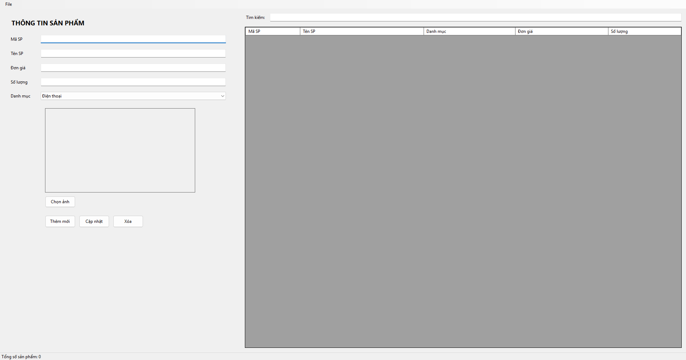
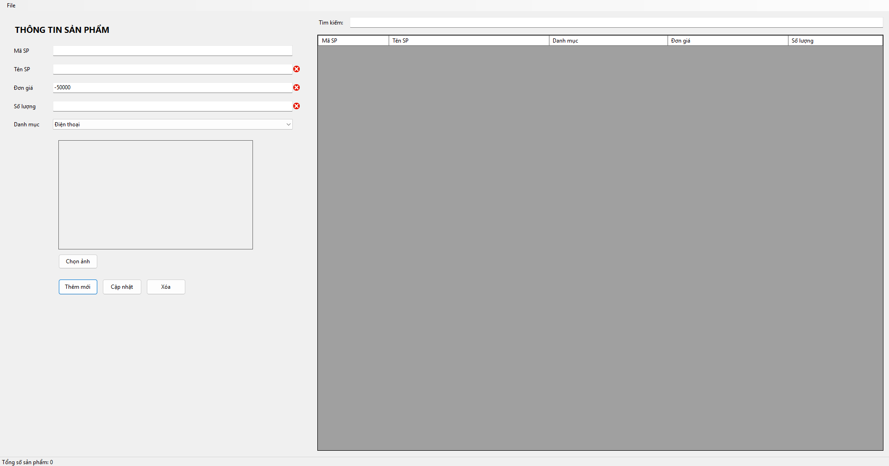
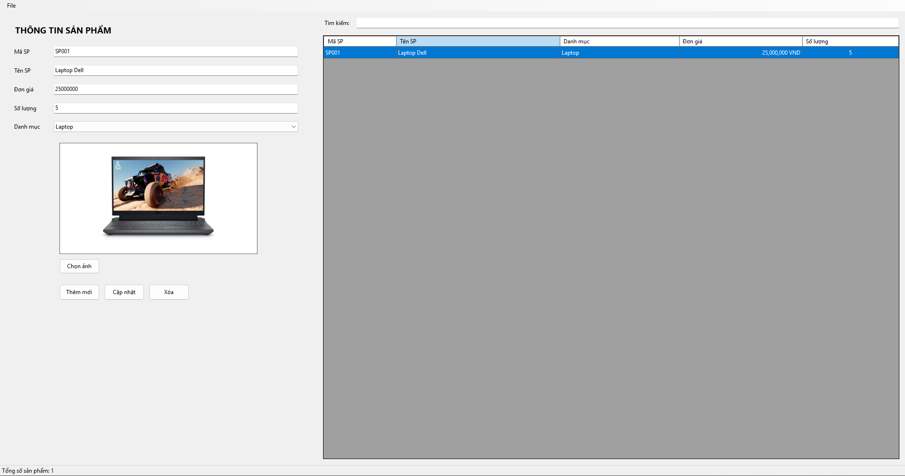
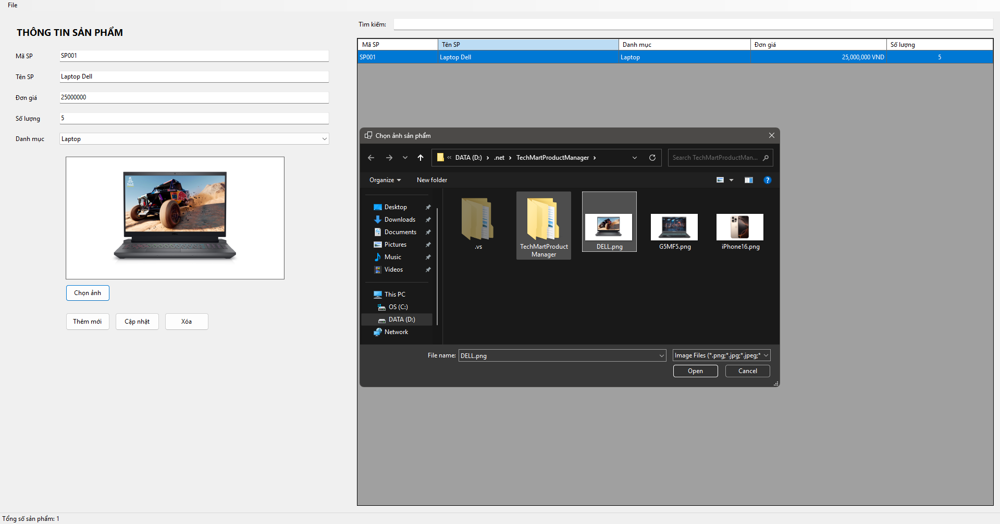
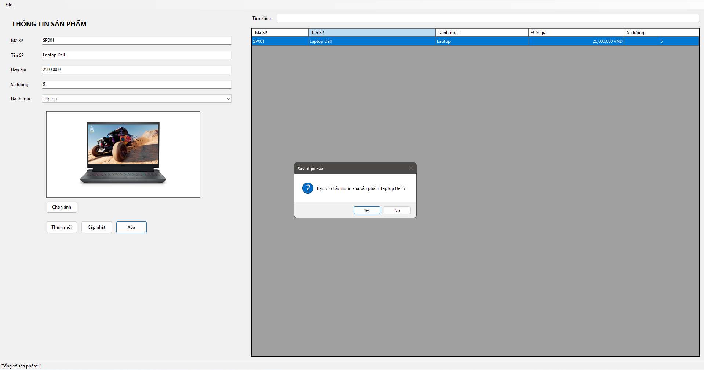

# BÀI 3 - WINDOWS FORMS

## TechMart Product Manager

Quản lý danh mục thiết bị công nghệ bằng Windows Forms.

---

# KẾT QUẢ KIỂM THỬ

## TC01 - Kiểm tra Responsive Layout

---

## TC02 - Kiểm tra Validation bằng ErrorProvider

---

## TC03 - Kiểm tra Data Binding và định dạng dữ liệu

---

## TC04 - Kiểm tra chọn ảnh bằng OpenFileDialog

---

## TC05 - Kiểm tra chức năng Xóa sản phẩm

---

# SOURCE CODE

Code bài được lưu trong thư mục:

`Code/TechMartProductManager`
