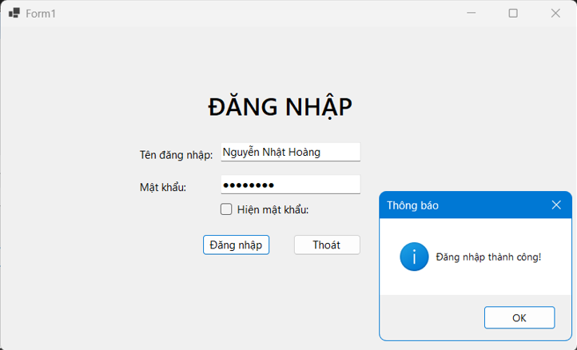
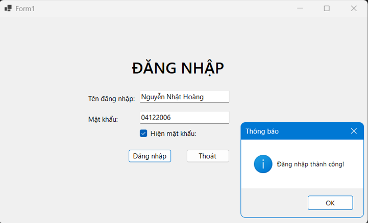
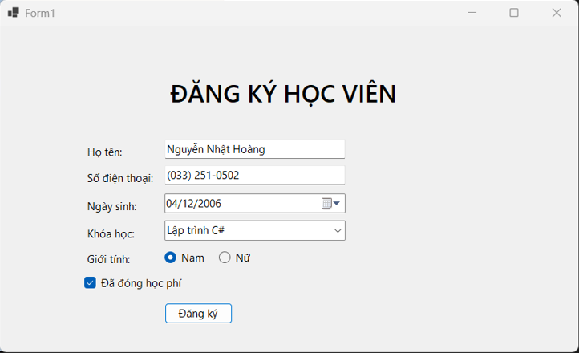
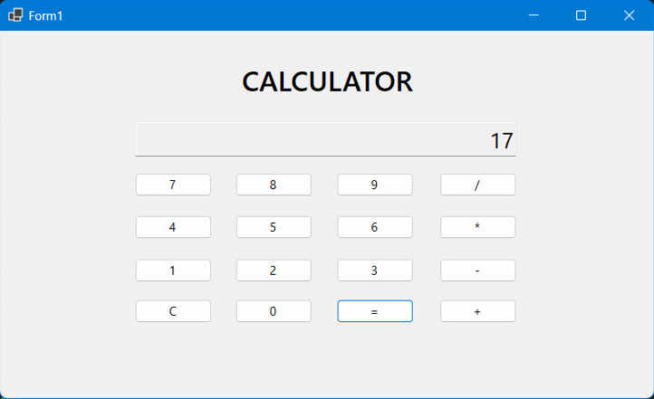
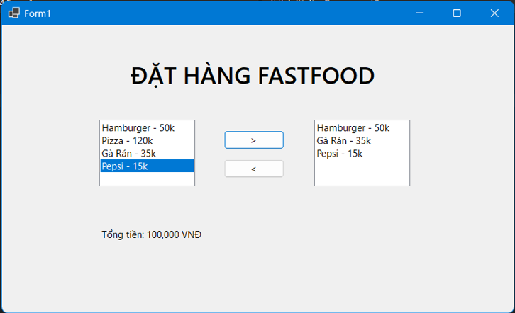

# Lập trình .NET

**Họ và tên:** Nguyễn Nhật Hoàng  

**Lớp:** D19CNPM5  

**Mã sinh viên:** 24810310478  

# BÀI TẬP NGÀY 24/09/2026

## BÀI 4.1

### Form ĐĂNG NHẬP

---

## BÀI 4.2

### Form ĐĂNG KÝ

---

## BÀI 4.3

### Form CALCULATOR

---

## BÀI 4.4

### Form ĐẶT HÀNG FASTFOOD

---

## CODE BÀI

[Xem toàn bộ code](https://github.com/kzexyz/NguyenNhatHoangLTNET/tree/main/BAI-TAP-24-09-2026)
